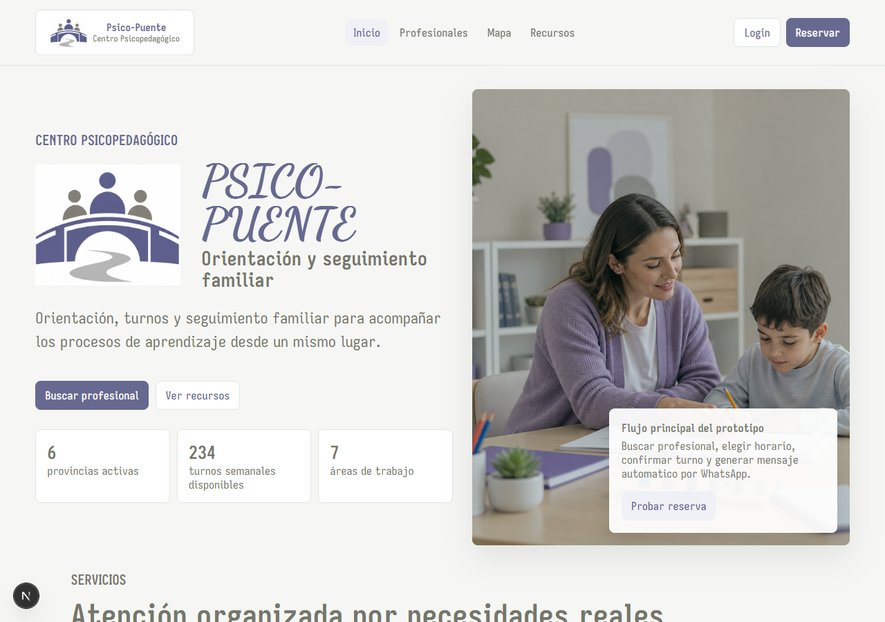
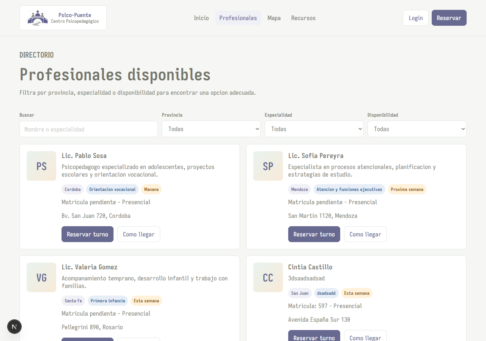
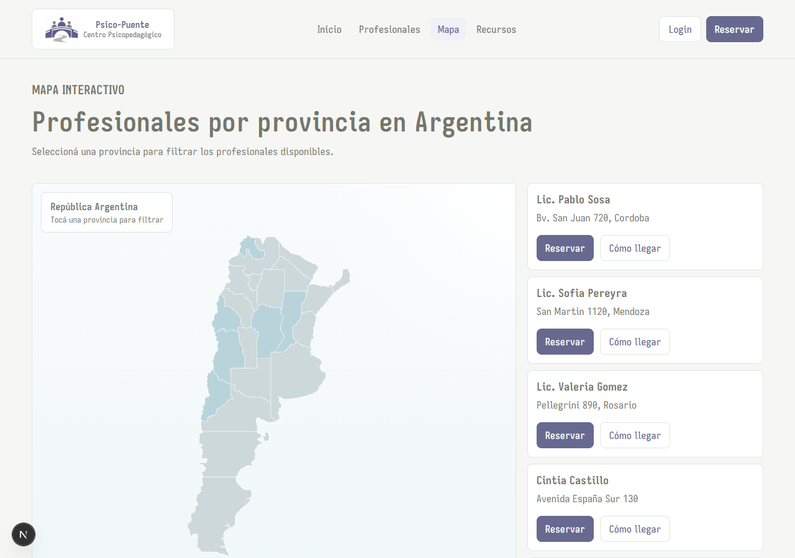
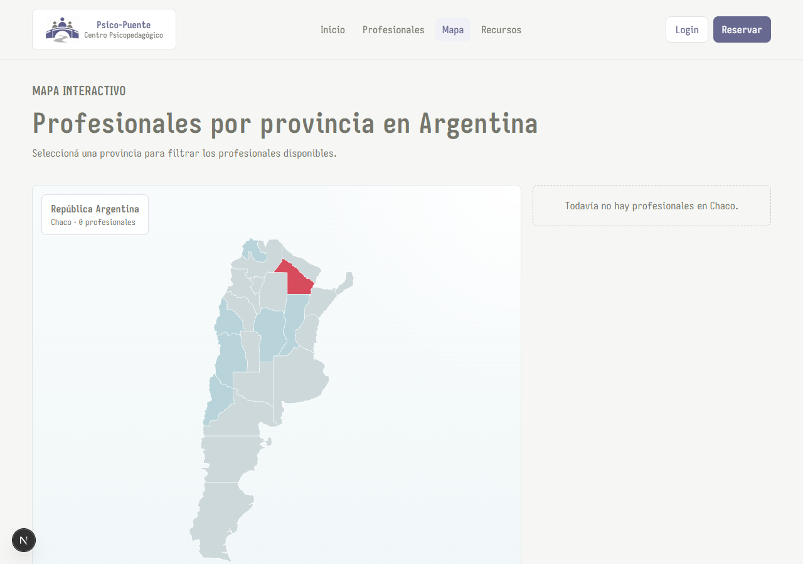
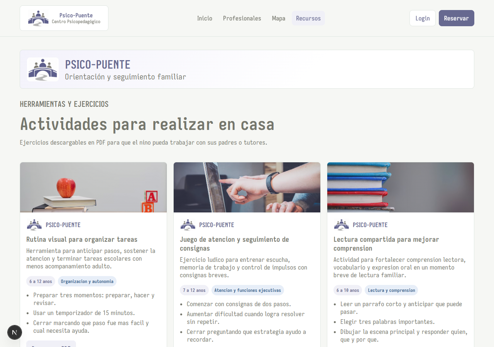
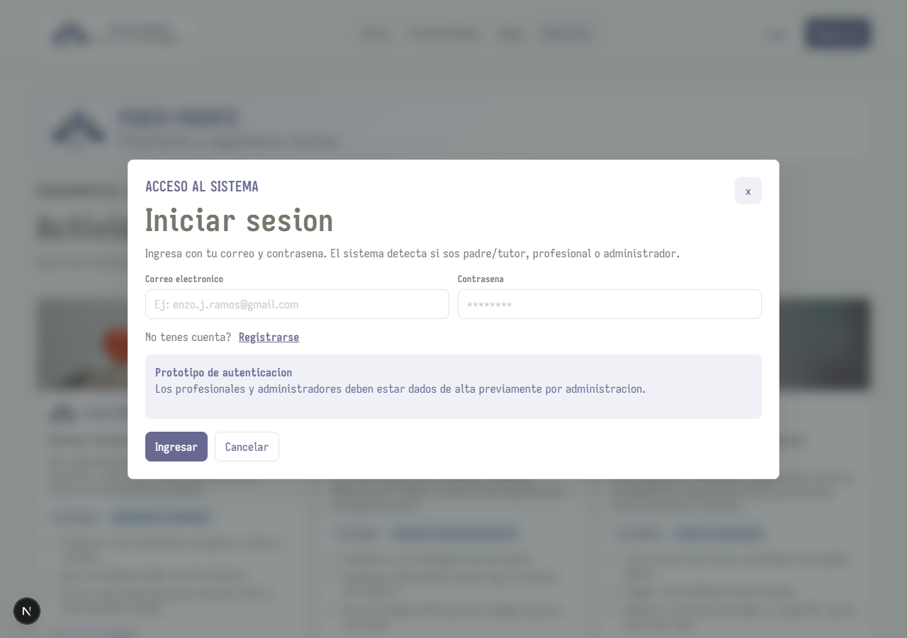
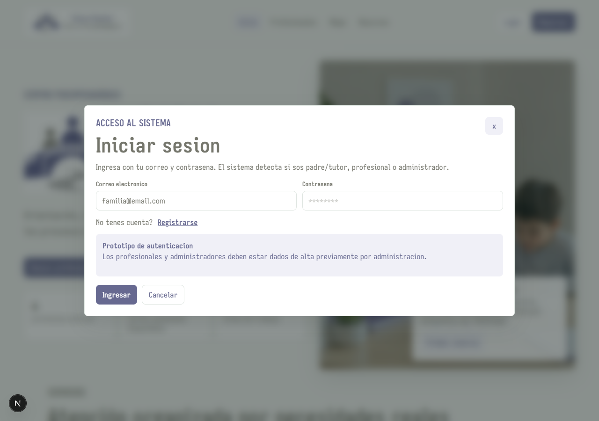
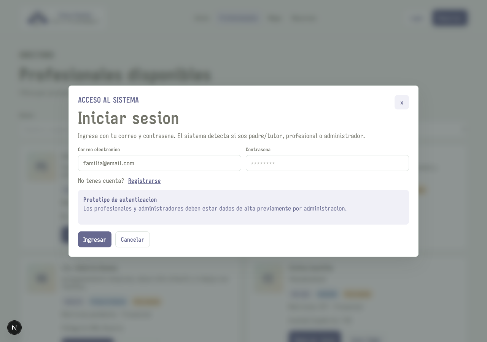
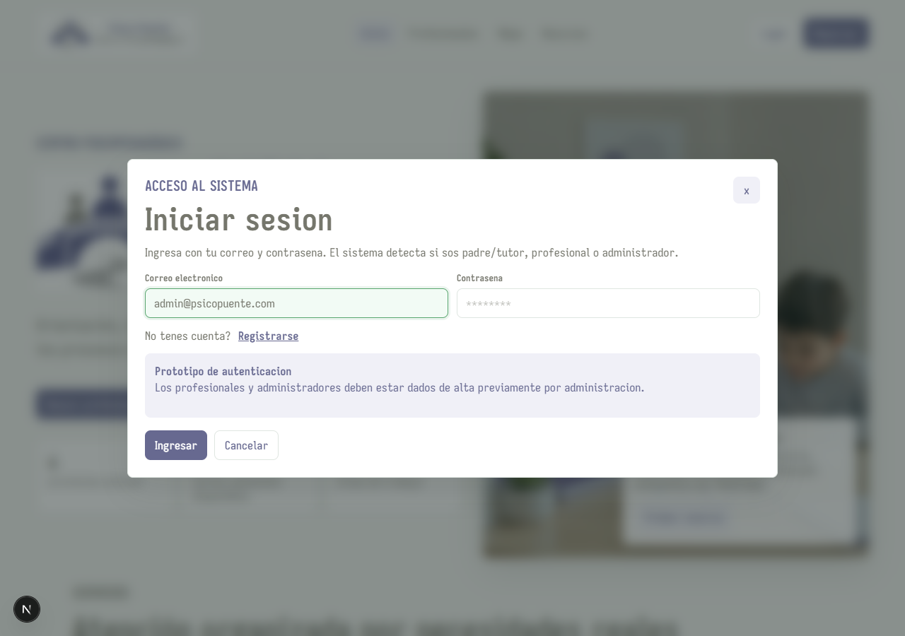

# Documentacion Visual — Psico-Puente

Capturas de pantalla de cada sección funcional de la aplicación.

**URL desplegada:** https://prototipo-alpha-cyan.vercel.app

---

## 1. Página de inicio

La página principal presenta el centro psicopedagógico con su misión, servicios y llamada a la acción. Incluye navegación superior con acceso a todas las secciones, botón de Login y botón Reservar.

---

## 2. Directorio de profesionales

Lista todos los profesionales activos con su especialidad, disponibilidad y dirección. Cada tarjeta tiene botones para reservar un turno o ver cómo llegar mediante Google Maps.

---

## 3. Mapa interactivo de Argentina

Mapa SVG geográfico real con las 24 provincias argentinas. Las provincias con profesionales activos se muestran en color azul claro. El usuario puede hacer clic en cualquier provincia para filtrar los profesionales de esa zona.

---

## 4. Mapa con provincia seleccionada

Al hacer clic en una provincia, se pinta de rojo y la lista de profesionales se filtra automáticamente para mostrar solo los de esa provincia. La etiqueta superior muestra el nombre de la provincia y la cantidad de profesionales disponibles.

---

## 5. Sección de recursos

Material educativo orientado a familias: rutinas visuales, juegos de atención, lectura compartida y herramientas de regulación emocional. Cada recurso incluye un resumen, rango de edad y área de trabajo.

---

## 6. Modal de inicio de sesión

Modal accesible desde cualquier pantalla. El usuario ingresa su email y el sistema identifica el rol (familia, profesional o administrador). No requiere contraseña en modo demo.

---

## 7. Inicio con sesión familiar activa

Una vez logueada como familia, la barra superior muestra el nombre del usuario y el botón cambia a "Mi Panel". La sesión persiste mientras el usuario navega por la app.

---

## 8. Panel familiar

Panel exclusivo para familias. Muestra los próximos turnos agendados, el historial de sesiones con objetivos y notas del profesional, y un indicador de progreso del proceso terapéutico del hijo/a.

---

## 9. Reserva de turno con calendario

Formulario de reserva de turno. Muestra un calendario de lunes a viernes con horarios disponibles (9 a 12 y 17 a 20). Los turnos ya ocupados aparecen bloqueados. Al confirmar, se genera automáticamente un mensaje de WhatsApp con todos los datos del turno.

---

## 10. Panel profesional

Panel exclusivo para profesionales. Muestra la agenda con solicitudes de turno pendientes y aceptadas, el listado de pacientes y acceso a los informes de sesión cargados.

---

## 11. Panel administrador

Panel exclusivo para el administrador del centro. Permite dar de alta, editar, activar y desactivar profesionales (ABM completo). También muestra estadísticas generales: turnos realizados, profesionales activos y familias registradas.

---

## Resumen de flujos principales

| Flujo | Rol requerido | Pantallas involucradas |
|---|---|---|
| Buscar profesional por provincia | Ninguno (público) | Mapa → filtro por provincia |
| Ver perfil y cómo llegar | Ninguno (público) | Profesionales → Google Maps |
| Reservar un turno | Familia (login) | Login → Profesionales → Reservar → WhatsApp |
| Ver historial de sesiones | Familia (login) | Panel familiar |
| Gestionar agenda | Profesional (login) | Panel profesional |
| Alta de profesionales | Administrador (login) | Panel administrador |
